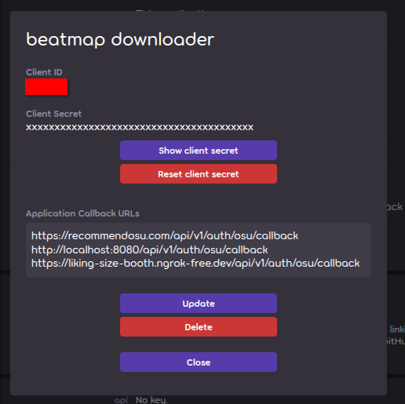
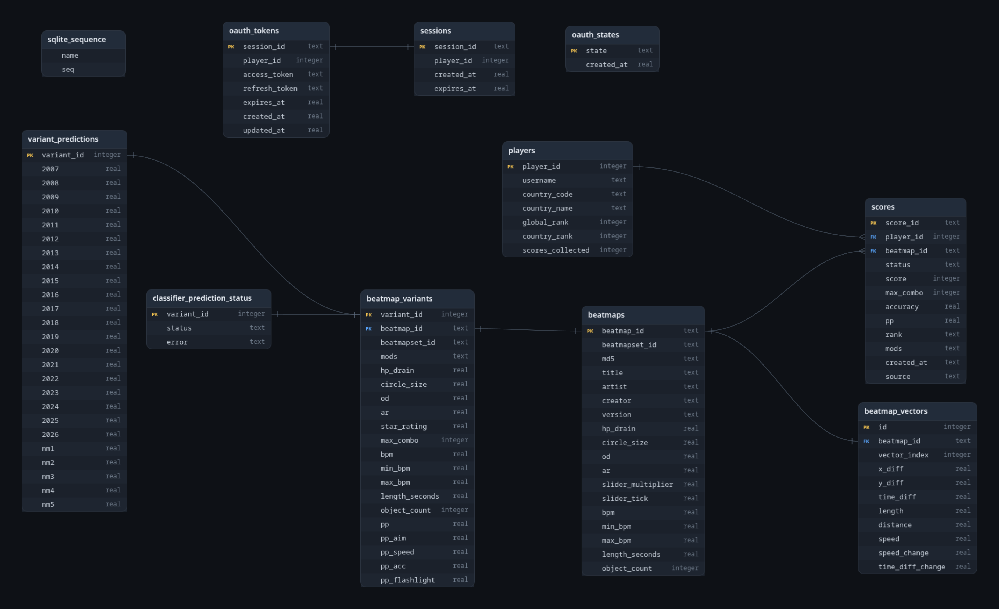

# recommendosu

I will slowly document all of this in my free time. This project is running on my PC at [recommendosu.com](https://recommendosu.com/).

I've created a Discord server [here!](https://discord.gg/Dh4TzKGGB7)

This recommender fetches your top/recent plays via your osu! API token, 
and performs a calculation to find the 20000 nearest neighbors (configurable) to each top/recent play. 
If no mod filters are applied, multiply this by the repository's available combinations (20) and we get at worst 4 million vectors to sort and obtain the top recommendations. 
I have optimized this down to around 10 seconds for outputting the top 1000 recommendations to the frontend.

I opted with a content similarity approach, as I found that performing user-user/item-item collaborative filtering is difficult due to the time needed to gather of per-country user play data.

Credit to [osu!Oracle](https://github.com/token03/osu_oracle) for getting started on this repository's beatmap classifier. 
See [AlphaOSU](https://github.com/AlphaOSU/AlphaOSU), 
[pupsbot](https://github.com/Pupariaa/pupsbot), 
[osu-pps](https://osu-pps.com/#/osu/maps), 
and [Bryan Chan's](https://bryanchan.org/blog/pp-recommender) implementations/deployments for inspiration.

This project was developed on my PC (shown below), and does not require a GPU to recommend maps. 
The GPU was used to train the CNN-XGboost model for classifying maps in tournament categories NM1 to NM5. 
I precomputed the classifier's predictions on the ranked beatmaps from 2007-2026, and inserted them into `/beatmap_recommender/recommender.local.db` (or equivalently `beatmap_recommender/recommender.db`).

```aiignore
OS - Fedora 44
IDE - PyCharm, with the miniconda distribution
CPU - AMD Ryzen 7 5700X
GPU - ASUS Prime RTX 5060 Ti 16GB
RAM - Crucial (2 x 32GB) DDR4-3200MHz CL32
```

# Data

The classifier's dataset are tournament maps in [NM1](https://osucollector.com/collections/18935/NM1), 
[NM2](https://osucollector.com/collections/18936/NM2), [NM3](https://osucollector.com/collections/18937/NM3), 
[NM4](https://osucollector.com/collections/18938/NM4), and [NM5](https://osucollector.com/collections/18939/NM5).
Shoutouts to [Specter](https://osu.ppy.sh/users/14551370) for making many tournament collections publicly available.

The recommender's dataset are all ranked beatmaps from 2007-2026, seen from this: [2007-2023](https://osu.ppy.sh/community/forums/topics/330552?n=1), [2024-2026](https://osu.ppy.sh/community/forums/topics/2045828?n=1)

I will provide the download link to the .osu files, the classifier database, and the recommender database ([here!](https://www.mediafire.com/file/imtk1ttkqumogel/recommendosu-data_25-09-2026.zip/file)).

# Requirements

Required Python libraries are:

```aiignore
fastapi
httpx
matplotlib
numpy
pandas
osu-tools-py
pydantic
python-dotenv
Requests
scipy
torch
tqdm
optuna
uvicorn[standard]
```

# Running the code

The entry points will be listed below:

### OSDB Parser

- `/osdb_parse/osdb_parser.py`: Parses a .osdb file located at `/osdb_parse/inputs`. See the comment at the top of the file to obtain .osdb files. I needed to use this to extract the .osdb files for NM1 to NM5, along with some other tournament formats to play around with.

### Beatmap Classifier

- `/beatmap_classifier/dot_osu_extract/downloader_backoff.py`: Given .txt file of beatmap IDs, downloads .osu files with exponential backoff, via the osu! API v2
- `/beatmap_classifier/classifier_db_setup/osu_parser_modded.py`: Populates `/beatmap_classifier/beatmaps.db` for the CNN-XGBoost model.
- `/beatmap_classifier/train_cnn_model.ipynb`: Used to train the CNN-XGBoost model.
- `/beatmap_classifier/test_model.py`: Can input beatmap IDs and see the prediction probabilities.
- `/beatmap_classifier/data/extract_osu.py`: Extracts .osu files from directories of .osz archives.

If you do populate `/beatmap_classifier/beatmaps.db` by yourself, 
please run `/beatmap_classifer/view_multicategory_maps.sql` and `/beatmap_classifier/clean_multicategory_maps.sql` in the database browser of your choice.
I used DB Browser for SQLite while making this project.

### Beatmap Recommender

- `/beatmap_recommender/data/extract_osu.py`: Extracts .osu files from directories of .osz archives.
- `/beatmap_recommender/recommender_db_setup/populate.py`: Populates `beatmap_recommender/recommender.local.db` for the recommender. We needed a separate population script for the beatmapset ids, and to prevent inserting the CNN vectors.
- `/beatmap_recommender/recommender_db_setup/precompute_nm1-5.py`: Populates `beatmap_recommender/recommender.local.db` with the CNN-XGBoost probabilities for each beatmap.
- `/beatmap_recommender/content_similarity/test_recommender.py`: You can run this to see what the recommendations would look like. If you're running this from the CLI, this is the command (`PYTHONPATH=. python beatmap_recommender/content_similarity/test_recommender.py
`)
- `/beatmap_recommender/recommender.py`: The recommender for the backend. You can tweak some of the global variables if desired.

Running the database population script takes a while (~7h30m), because the .osu files before version 10 do not have beatmap id and approach rate values. 
The code attempts to retrieve them by getting the file's MD5 hash and calling the osu! API. 
Despite that, it may return 404, so I set the beatmap id as the hash and the AR to 8 as a fallback.

If there is one file I would choose to really understand, it's `/beatmap_recommender/content_similarity/core_modules/variant_ranking.py`.

### Frontend

This was meant to be run with Docker compose. See the Docker Commands section later.

# Docker Commands

Some Docker commands to get you started...

### Local

```aiignore
### everything
HOST_UID=$(id -u) HOST_GID=$(id -g) docker compose -p recommendosu-local -f compose.yml -f compose.local.yml up --build -d

### rebuild/recreate nginx first
HOST_UID=$(id -u) HOST_GID=$(id -g) docker compose -p recommendosu-local -f compose.yml -f compose.local.yml build nginx && \
HOST_UID=$(id -u) HOST_GID=$(id -g) docker compose -p recommendosu-local -f compose.yml -f compose.local.yml up -d --no-deps nginx

### rebuild/recreate frontend and backend without touching nginx
HOST_UID=$(id -u) HOST_GID=$(id -g) docker compose -p recommendosu-local -f compose.yml -f compose.local.yml build frontend backend && \
HOST_UID=$(id -u) HOST_GID=$(id -g) docker compose -p recommendosu-local -f compose.yml -f compose.local.yml up -d --no-deps frontend backend

### soft shutdown and restart to test nginx-only page
docker compose -p recommendosu-local -f compose.yml -f compose.local.yml stop frontend backend
docker compose -p recommendosu-local -f compose.yml -f compose.local.yml start frontend backend

### logs
docker compose -p recommendosu-local -f compose.yml -f compose.local.yml logs -f

### full shutdown
docker compose -p recommendosu-local -f compose.yml -f compose.local.yml down
```

### Production

```aiignore
### everything
docker compose -p recommendosu-prod -f compose.yml -f compose.production.yml up --build -d

### rebuild/recreate nginx first
docker compose -p recommendosu-prod -f compose.yml -f compose.production.yml build nginx && \
docker compose -p recommendosu-prod -f compose.yml -f compose.production.yml up -d --no-deps nginx

### rebuild/recreate frontend and backend without touching nginx
docker compose -p recommendosu-prod -f compose.yml -f compose.production.yml build frontend backend && \
docker compose -p recommendosu-prod -f compose.yml -f compose.production.yml up -d --no-deps frontend backend

### soft shutdown and restart to test nginx-only page
docker compose -p recommendosu-prod -f compose.yml -f compose.production.yml stop frontend backend
docker compose -p recommendosu-prod -f compose.yml -f compose.production.yml start frontend backend

### logs
docker compose -p recommendosu-prod -f compose.yml -f compose.production.yml logs -f

### full shutdown
docker compose -p recommendosu-prod -f compose.yml -f compose.production.yml down
```

# Tips

If you're messing around with the codebase and the login doesn't work, check if `OSU_REDIRECT_URI` in `.env.local` or `.env.production` are really in your OAuth Application:



The database schema, generated by [SQLite to ER Diagram](https://sqltoerdiagram.com/sqlite/), looks like this:


